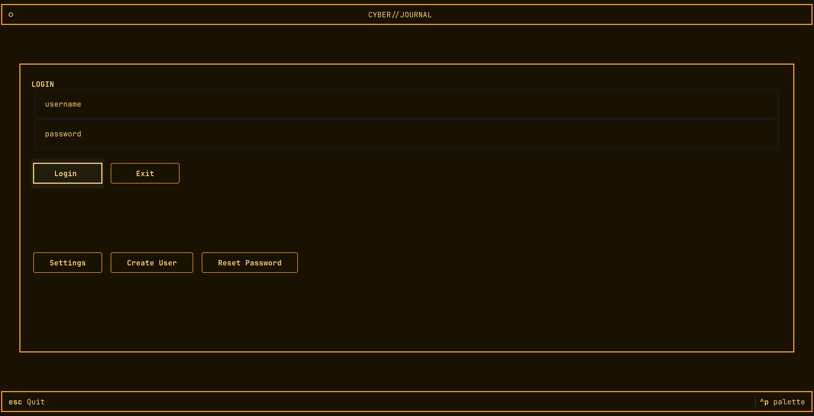
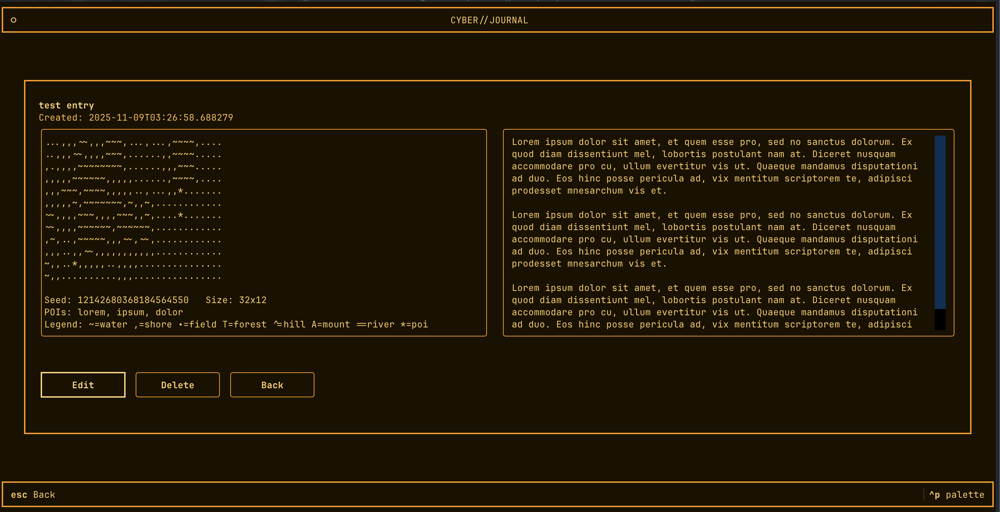

# CYBER//JOURNAL

A terminal-first, encrypted personal journal with a retro UI, blind-index search, and optional ASCII mini-maps generated from your entry text.



---

## ✨ Features

- **End-to-End Encryption** for titles, bodies, and map previews
- **Blind Index Search**: search without revealing plaintext keywords
- **Procedural ASCII Map Previews** based on your writing
- **Multiple Retro Themes** (Green / Amber / Neon)
- **Single-file, Local Database** (SQLite)
- **TUI Interface** built with Textual

---

## 🔐 Encryption Overview

- Passwords are hashed using **Argon2**
- A **DEK (Data Encryption Key)** is generated per user
- AES-GCM encrypts:
  - Entry title
  - Entry body
  - Generated map preview
- **Search** uses blind indexing:
  - Words → normalized → HMACed with a search key
  - Database stores only hashes

This means your journal remains private even if the database file is accessed.

---

## 🗺️ Procedural Map Preview

Every journal entry can optionally show a **tiny map**, like a miniature biome from a text-based RPG.



### How it works

| Step | Description |
|-----|-------------|
| 1 | Entry body is hashed to create a deterministic random seed |
| 2 | A noise function generates a 2D grid of terrain elevation |
| 3 | Elevation ranges map to symbols (water, grass, forest, mountains) |
| 4 | Frequently used meaningful words become **POIs (Points of Interest)** |
| 5 | The final ASCII map is encrypted and stored alongside the entry |

### Example Output

```
~~..^^^
~..##^^
..##^^^
..###..
```

Symbols:
- `~` Water
- `.` Grass / plains
- `#` Forest
- `^` Mountain

---

## 🧰 UI Overview

| Section | Purpose |
|--------|---------|
| **Home** | Browse entries |
| **New Entry** | Write and save new journal text |
| **Search** | Blind-index search by keywords |
| **View Entry** | View text + map preview |
| **Settings** | Theme switch / preferences |


---

## 📂 Code Structure

```
crypto.py   → Key derivation, encryption, token hashing
logic.py    → Entry storage, decrypt/encrypt flow, map linking
map.py      → Procedural terrain + POI map generator
db.py       → SQLite schema and queries
ui.py       → Textual screens & interactions
theme.css   → Theming + retro color palettes
app.py      → App bootstrap
```

---

## 🚀 Install & Run

```bash
pip install -r requirements.txt
python app.py
```

Data is stored locally in a SQLite file created on first run.

---

## 🛡️ Notes

- Everything remains offline and local
- No analytics or network calls
- Database may be safely backed up or synced (it remains encrypted at rest)
