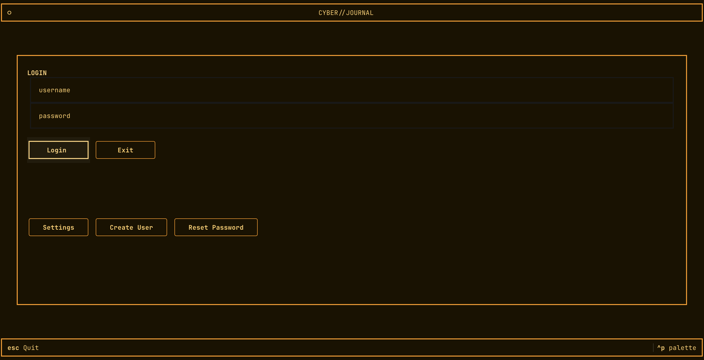
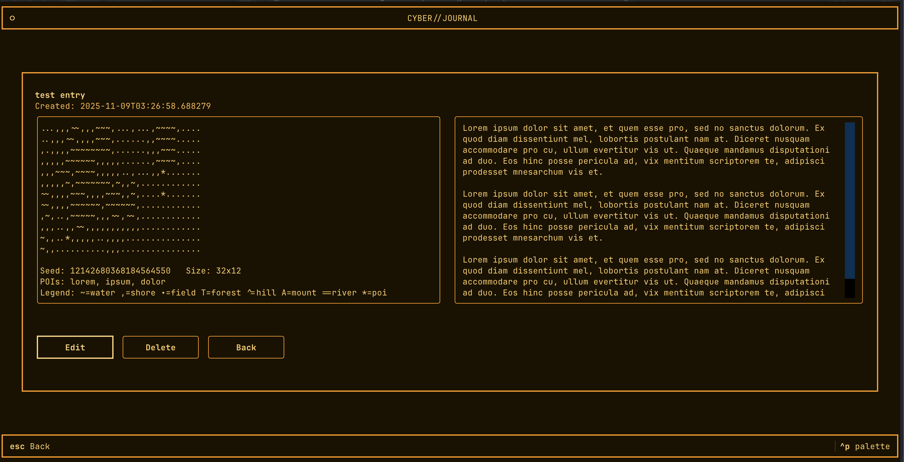
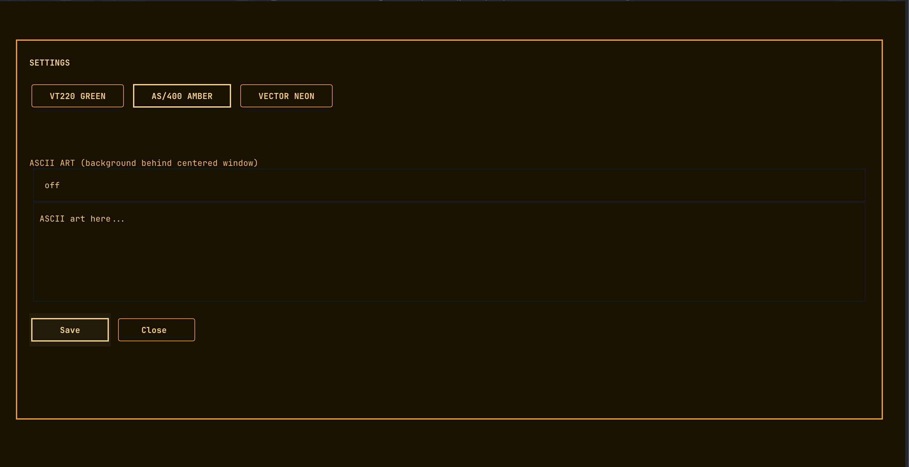

# CYBER//JOURNAL

A terminal-first encrypted personal journal with a retro TUI, blind-index search, procedural ASCII maps, and a living world simulation built from your journal entries — inspired by Dwarf Fortress.



---

## Features

### Journal
- **End-to-End Encryption** — titles, bodies, map previews, tags, mood, and weather all encrypted with AES-GCM
- **Blind Index Search** — search your entries without revealing plaintext keywords (HMAC-SHA256)
- **Procedural ASCII Map Previews** — deterministic terrain generated from your writing
- **Multiple Retro Themes** — VT220 Green, AS/400 Amber, Vector Neon
- **Single-file Local Database** — SQLite via aiosqlite, fully offline
- **TUI Interface** — built with Textual

### Organization
- **Favorites** — star entries for quick access
- **Tagging System** — encrypted tags with blind-index tag search (`tag:name`)
- **Multi-Notebook Support** — organize entries into separate notebooks
- **Entry Templates** — save and reuse entry templates
- **Date-Range Filtering** — filter entries by date range
- **Sorting & Pagination** — sort ascending/descending with paginated browse
- **Word Count Tracking** — automatic word count per entry
- **Calendar View** — month view with entry-count indicators per day
- **Auto-Save Drafts** — drafts saved every 30 seconds, restored on next session

### Mood & Weather
- **Mood Tracking** — select from happy, sad, neutral, anxious, energetic, calm
- **Weather Input** — optional weather notes per entry
- Mood data feeds directly into the world simulation (weather, events, NPC personality)

### Data Portability
- **Export** — decrypt and export entries to JSON or Markdown, with option to save to file or copy from the text area
- **Import** — import entries from JSON, automatically encrypted on ingest

---

## World Simulation

Each journal entry's map becomes a **chunk** in a persistent world. Chunks are placed on a meta-grid using keyword similarity — entries about similar topics are placed adjacent to each other.

### World Lifecycle

```
New Entry -> Generate Chunk -> Place on Grid -> Derive Biome
          -> Spawn Entity -> Generate NPCs -> Trigger Events
          -> Apply Weather -> Generate Quests -> Place Hidden Landmarks
          -> Award XP
```

### Eras

The world progresses through eras based on total entries:

| Entries | Era |
|---------|-----|
| 0-9 | Primordial Era |
| 10-24 | Dawn Age |
| 25-49 | Age of Exploration |
| 50-99 | Age of Growth |
| 100-199 | Age of Civilization |
| 200+ | Age of Prosperity |

### Biome System

15 biomes derived from terrain type, elevation, and moisture:

| Category | Biomes |
|----------|--------|
| Water | ocean, beach, riverbank |
| Lowland | grassland, savanna, desert, marsh |
| Forest | woodland, temperate forest, rainforest, highland forest |
| Highland | steppe, badlands, alpine, rocky peaks |

Each biome has its own resource production, NPC roles, encounter rates, and visual palette.

### Entity Generation

Entities are placed based on entry metadata:

| Condition | Entity Type | Symbol |
|-----------|-------------|--------|
| Word count > 200 | Settlement | `H` |
| Sad/anxious mood | Ruin | `%` |
| Calm/neutral mood | Shrine | `+` |
| Forest biome | Resource | `$` |
| Default | Landmark | `!` |
| ~33% chance | Hidden Landmark | `?` |
| From entry names | NPC | `P` |
| Player-built | Structure | `#` |

### NPCs

- Proper nouns from entry text become NPC names
- Personality derived from entry mood (cheerful, melancholic, nervous, adventurous, wise, stoic)
- Roles assigned by biome (farmer, woodcutter, miner, herbalist, ranger, trader, etc.)
- NPCs have dialogue with personality-based greetings and role-specific lore

### Quests

Template quests generated from entry keywords:

| Keywords | Quest Type |
|----------|-----------|
| travel, journey | Explore |
| discover, find, search | Discover |
| deliver, bring, trade | Deliver |
| protect, defend, guard | Protect |
| gather, collect, harvest, build | Gather |

Quests complete automatically when you move near the target location.

### Events & Weather

- **Mood events**: festivals, storms, mourning, construction, peace, trade caravans
- **Keyword events**: discoveries, conflicts, blessings, weather changes, visions
- **Weather system**: mood-driven with cellular automaton propagation across chunks

---

## World Explorer Game Features

The world explorer is a full game layer built on top of the journal's world simulation. Explore, fight, trade, and build in a world generated from your own writing.

### Exploration Controls

| Key | Action |
|-----|--------|
| Arrow keys | Move cursor |
| Enter | Inspect / interact with entity |
| `i` | Open inventory |
| `s` | Open stats sheet |
| `m` | Toggle minimap overlay |
| `c` | Open crafting menu |
| `q` | View active quests |
| `h` | View world history timeline |
| Escape | Return to journal / cancel placement |

### Day/Night Cycle

Time advances 30 in-game minutes per movement (48 moves = full day). Four time periods with distinct color palettes:

| Period | Hours | Visual Style |
|--------|-------|-------------|
| Dawn | 5:00–7:00 | Warm yellows |
| Day | 7:00–18:00 | Full color |
| Dusk | 18:00–20:00 | Purple/magenta tones |
| Night | 20:00–5:00 | Dimmed, dark grays |

The current time, day count, and period are shown in the info bar.

### Player Stats & Leveling

Earn XP from exploration and actions. Level up through an 11-tier progression:

| Action | XP Awarded |
|--------|-----------|
| Explore a new tile | 1 |
| Complete a quest | 50 |
| Win a battle | 40 |
| Discover a landmark | 30 |
| Write a journal entry | 20 |
| Craft an item | 15 |
| Trade an item | 5 |

The HUD displays level, XP progress, and tiles explored. Press `s` for the full stats sheet with exploration, combat, crafting, and journal statistics.

### Inventory

Press `i` to view your inventory. Items are grouped by type:

- **Resources** — timber, stone, herbs, ore, grain, fish, gems, and more (produced by biomes)
- **Currency** — scraps (used for trading)
- **Weapons** — iron sword, wooden club, stone axe
- **Consumables** — health potions, trail rations

Items are gained through combat loot, trading, and resource gathering.

### Interactive Entities

Press Enter on an entity to interact:

| Entity | Interaction |
|--------|------------|
| **NPC** | Dialogue screen with personality greetings and lore; press `t` to trade if near a settlement |
| **Settlement** | Trade screen — buy/sell resources for scraps |
| **Shrine/Ruin/Landmark** | Atmospheric text with journal entry excerpts |
| **Any tile** | View source journal entry |

### Trading

Settlements produce resources based on surrounding biomes. Trade using scraps as currency:

- Press Enter on a settlement to open the trade screen
- `b` to buy the next available resource
- `v` to sell your first sellable item
- Prices based on resource rarity (grain=1, herbs=3, ore=4, gems=8 scraps)

### Combat Encounters

Random encounters trigger while exploring. Encounter rates vary by biome:

| Biome | Rate | Example Enemies |
|-------|------|----------------|
| Badlands | 12% | Rock Golem, Dust Wraith |
| Rainforest | 10% | Giant Snake, Jungle Stalker |
| Rocky Peaks | 9% | Stone Gargoyle, Peak Wyvern |
| Forest | 8% | Wild Boar, Bandit Scout |
| Grassland | 4% | Wild Dog Pack, Highwayman |
| Beach | 2% | (rare) |

A 10-move cooldown prevents encounter spam. When combat triggers:

- **Fight** — auto-resolved based on player level vs enemy stats; win to earn loot and XP
- **Run** — chance to flee scales with level; may take damage on failure
- **Negotiate** — talk your way out (costs scraps on success); chance scales with level

Winning a fight adds the enemy's loot to your inventory (hides, ore, herbs, scraps, gems, etc.).

### Building & Crafting

Press `c` to open the crafting menu. Recipes consume resources from your inventory:

| Recipe | Ingredients | Structure | XP |
|--------|------------|-----------|-----|
| Campfire | 2 timber | `f` | 10 |
| Watchtower | 5 timber + 3 stone | `T` | 30 |
| Stone Shrine | 4 stone + 2 herbs | `+` | 20 |
| Trade Post | 6 timber + 10 scraps | `H` | 50 |

After selecting a recipe, enter **placement mode**: move the cursor to choose a location, press Enter to build, or Escape to cancel. Built structures appear on the world map as persistent entities.

### Minimap

Press `m` to toggle a minimap overlay in the top-right corner of the viewport. The minimap shows:

- Scaled-down terrain of the entire world
- Entity positions (settlements, landmarks, NPCs)
- Your current position (`@`)

Useful for orienting yourself in large worlds with many journal entries.

---

## Encryption Architecture

```
Password -> Scrypt(salt) -> KEK -> HKDF("wrap-key") -> wraps DEK (AES-GCM)
DEK -> HKDF("cyberjournal/enc-key") -> enc_key (encrypts entries)
DEK -> HKDF("cyberjournal/search-key") -> search_key (HMAC blind index tokens)
```

- Each encrypted field has its own random 12-byte nonce
- AAD = username for all AES-GCM operations
- Password change re-encrypts all entries atomically (single transaction)
- Password reset via security question wipes all entries (by design)
- Search uses HMAC-SHA256 blind indexing — only hashes stored, never plaintext keywords

---

## Procedural Map Preview

Every journal entry generates a **deterministic ASCII map** — same text always produces the same terrain.



### How it works

| Step | Description |
|------|-------------|
| 1 | Entry body is hashed to create a deterministic random seed |
| 2 | A noise function generates a 2D grid of terrain elevation and moisture |
| 3 | Elevation + moisture ranges map to terrain symbols and biomes |
| 4 | Frequently used meaningful words become **POIs (Points of Interest)** |
| 5 | The final ASCII map is encrypted and stored alongside the entry |

### Symbols

| Symbol | Terrain |
|--------|---------|
| `~` | Water |
| `.` | Grass / plains |
| `#` | Forest |
| `^` | Mountain |
| `*` | Point of interest |

---

## UI Overview

| Tab | Purpose |
|-----|---------|
| **Browse** | Paginated entry list with sort and notebook filter |
| **New Entry** | Write entries with mood, weather, and template support |
| **Search** | Blind-index keyword search and `tag:` prefix search |
| **Calendar** | Month view showing entries per day |
| **World** | Launch the world explorer |
| **Account** | Settings, password change, export/import, logout |

Additional screens:
- **View Entry** — full text + map preview, edit, delete, favorite, tag management
- **World Explorer** — arrow-key map navigation with color rendering, day/night cycle, combat, trading, crafting, and minimap
- **World History** — scrollable chronological event timeline grouped by era



---

## Code Structure

```
cyberjournal/
  crypto.py       Key derivation, AES-GCM encryption, HMAC blind indexing
  db.py           Async SQLite schema, queries, migrations
  logic.py        Business logic: auth, entry CRUD, search, tags, notebooks,
                  templates, export/import, drafts, calendar, pagination
  map.py          Procedural terrain + POI map generator
  ui.py           Textual TUI screens, modals, and tab navigation
  theme.css       Three retro themes (VT220 Green, AS/400 Amber, Vector Neon)
  errors.py       Domain exception hierarchy

  world/
    world_db.py     Separate SQLite DB for world state persistence
    grid.py         Chunk placement via keyword similarity (Jaccard index)
    biomes.py       Terrain x elevation x moisture -> 15 biome types
    timeline.py     Era system, turn progression, world history
    renderer.py     Tile-based viewport rendering with Rich color markup
    explorer.py     Exploration screen + 7 modal screens (inventory, stats,
                    NPC dialogue, trade, landmark, combat, crafting)
    hooks.py        Bridge: journal entry events -> world simulation + XP
    events.py       Mood and keyword-driven world events
    weather.py      Mood-driven weather with cellular automaton propagation
    economy.py      Biome resource production, A* trade route pathfinding
    npcs.py         NPC extraction from proper nouns, biome-based roles
    quests.py       Template quest generation, completion tracking
    inventory.py    Item storage, catalog, add/remove/format
    player_stats.py XP/leveling system, stat tracking, HUD display
    daynight.py     Day/night cycle with 4 time-based color palettes
    interactions.py NPC dialogue, shrine text, settlement trading
    combat.py       Random encounters, fight/flee/negotiate resolution
    crafting.py     Recipe system, structure placement, resource consumption

app.py            Entry point
```

---

## Install & Run

```bash
pip install -r requirements.txt
python app.py
```

### Environment Variables

| Variable | Purpose | Default |
|----------|---------|---------|
| `CYBERJOURNAL_DB` | Path to journal database | `journal.sqlite3` |
| `CYBERJOURNAL_WORLD_DB` | Path to world database | `journal_world.sqlite3` |

### Development

```bash
# Install dev dependencies
pip install pytest pytest-asyncio pytest-cov ruff

# Run tests
pytest

# Run linter
ruff check .
```

Data is stored locally in SQLite files created on first run:
- `journal.sqlite3` — encrypted journal data
- `journal_world.sqlite3` — world simulation state

---

## Notes

- Everything remains offline and local
- No analytics or network calls
- Database may be safely backed up or synced (it remains encrypted at rest)
- World simulation hooks are non-fatal — journal functionality is never blocked by world errors
- All async operations use aiosqlite; all crypto is synchronous (CPU-bound)
- Password change is atomic (single transaction) — no risk of partial re-encryption
- The world explorer renders in full color using Rich markup, with palettes that shift across the day/night cycle
- Combat, trading, and crafting are entirely optional — the journal works independently of the game layer
